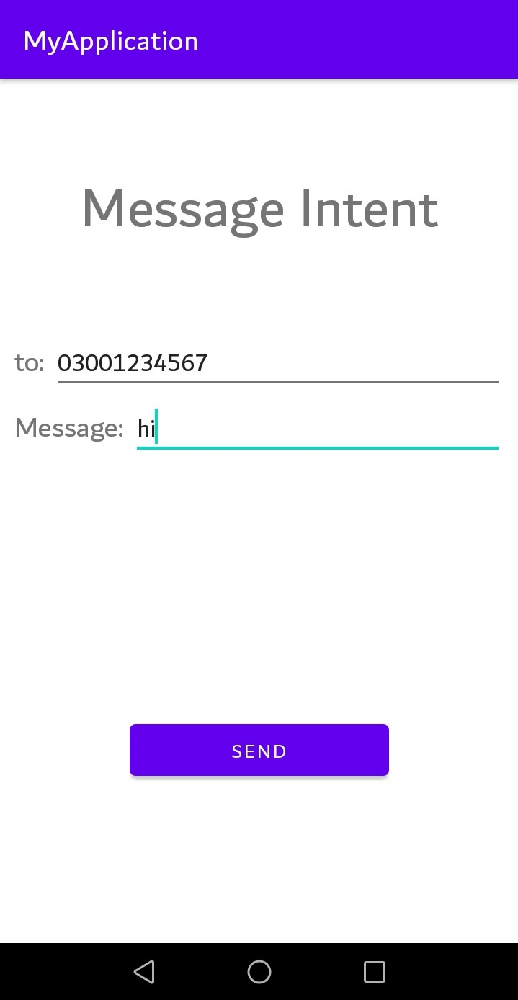
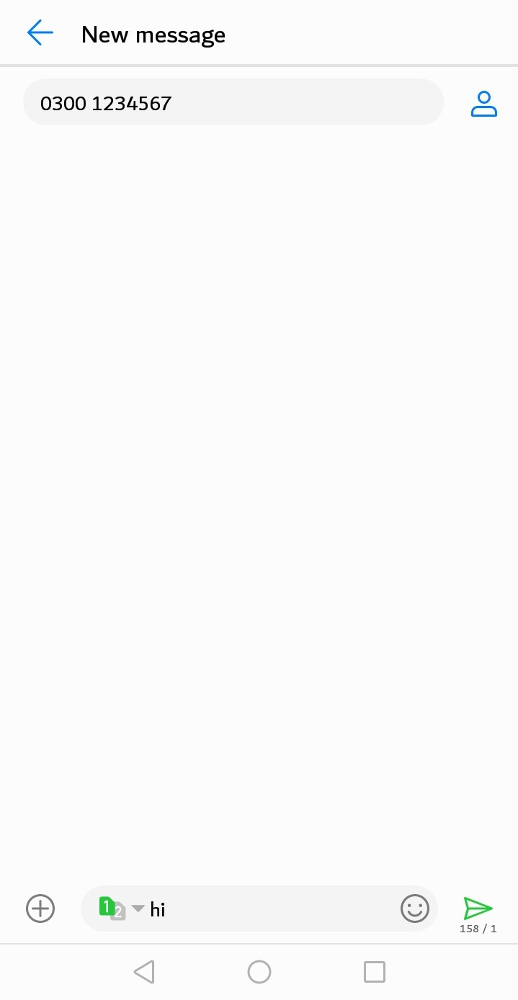
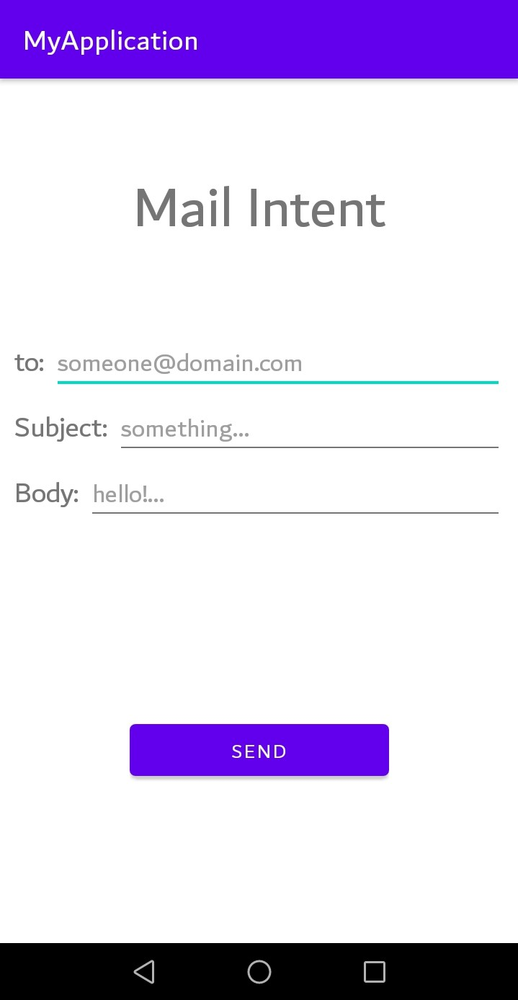
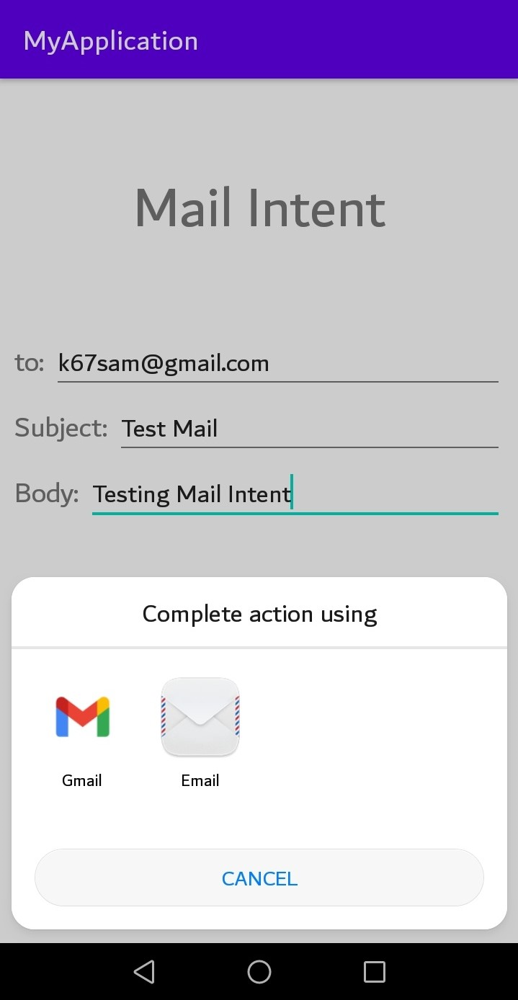
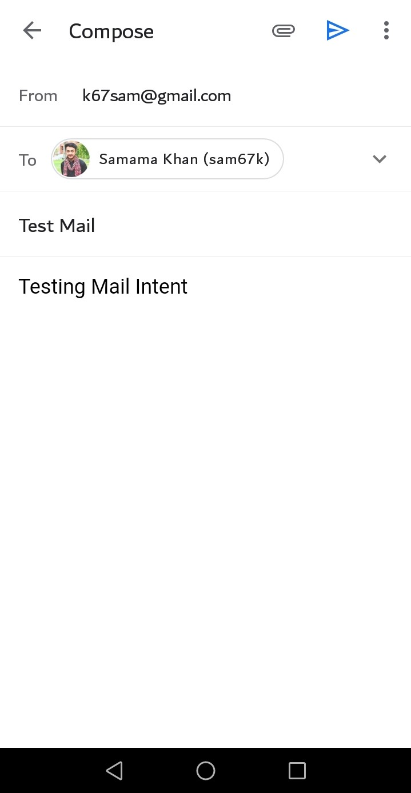

# Mobile Computing Lab Task - 11

## Question

```
Using Implicit intent create a application which should be capable enough to send a TextMessage and Email
```

<br/>

## Solution

<br/>

### Main Activity

### [activity_main.xml :](./MyApplication/app/src/main/res/layout/activity_main.xml)

```
<?xml version="1.0" encoding="utf-8"?>
<LinearLayout xmlns:android="http://schemas.android.com/apk/res/android"
    xmlns:app="http://schemas.android.com/apk/res-auto"
    xmlns:tools="http://schemas.android.com/tools"
    android:layout_width="match_parent"
    android:layout_height="match_parent"
    android:orientation="vertical"
    tools:context=".MainActivity"
    android:padding="20dp">

    <TextView
        android:layout_width="match_parent"
        android:layout_height="wrap_content"
        android:text="Intents"
        android:textSize="40dp"
        android:gravity="center"
        android:paddingBottom="60dp"
        android:paddingTop="50dp"/>

    <LinearLayout
        android:layout_width="match_parent"
        android:layout_height="match_parent"
        android:gravity="center|bottom"
        android:orientation="vertical"
        android:paddingBottom="100dp"
        android:paddingHorizontal="40dp">

        <TextView
            android:layout_width="match_parent"
            android:layout_height="wrap_content"
            android:layout_marginBottom="20dp"
            android:gravity="center"
            android:text="Select Intent"
            android:textSize="20dp" />
        <Button
            android:id="@+id/msg"
            android:layout_width="match_parent"
            android:layout_height="wrap_content"
            android:text="Send Text Message"
            android:onClick="msgintnt"/>
        <Button
            android:id="@+id/mail"
            android:layout_width="match_parent"
            android:layout_height="wrap_content"
            android:text="Send Email"
            android:onClick="mailintnt"/>

    </LinearLayout>

</LinearLayout>
```

<br/>

### [MainActivity.java :](./MyApplication/app/src/main/java/com/example/myapplication/MainActivity.java)

```
package com.example.myapplication;

import androidx.appcompat.app.AppCompatActivity;

import android.content.Intent;
import android.os.Bundle;
import android.view.View;

public class MainActivity extends AppCompatActivity {
    @Override
    protected void onCreate(Bundle savedInstanceState) {
        super.onCreate(savedInstanceState);
        setContentView(R.layout.activity_main);
    }

    public void msgintnt(View view) {
        Intent intent = new Intent(this, messageIntent.class);
        startActivity(intent);

    }

    public void mailintnt(View view) {
        Intent intent = new Intent(this, mailIntent.class);
        startActivity(intent);
    }
}
```

<br/>

### Text Message Intent Activity

### [activity_message_intent.xml :](./MyApplication/app/src/main/res/layout/activity_message_intent.xml)

```
<?xml version="1.0" encoding="utf-8"?>
<LinearLayout xmlns:android="http://schemas.android.com/apk/res/android"
    xmlns:app="http://schemas.android.com/apk/res-auto"
    xmlns:tools="http://schemas.android.com/tools"
    android:layout_width="match_parent"
    android:layout_height="match_parent"
    android:backgroundTint="@color/black"
    android:orientation="vertical"
    android:padding="10dp"
    tools:context=".MainActivity">

    <TextView
        android:layout_width="match_parent"
        android:layout_height="wrap_content"
        android:text="Message Intent"
        android:textSize="40dp"
        android:gravity="center"
        android:paddingBottom="60dp"
        android:paddingTop="50dp"/>

    <LinearLayout
        android:layout_width="match_parent"
        android:layout_height="wrap_content"
        android:orientation="horizontal">

        <TextView
            android:layout_width="wrap_content"
            android:layout_height="wrap_content"
            android:text="to: "
            android:textSize="20dp" />

        <EditText
            android:id="@+id/et1"
            android:layout_width="match_parent"
            android:layout_height="wrap_content"
            android:hint="03#########"
            android:inputType="number"/>

    </LinearLayout>

    <LinearLayout
        android:layout_width="match_parent"
        android:layout_height="wrap_content"
        android:orientation="horizontal">

        <TextView
            android:layout_width="wrap_content"
            android:layout_height="wrap_content"
            android:text="Message: "
            android:textSize="20dp" />

        <EditText
            android:id="@+id/et2"
            android:layout_width="match_parent"
            android:layout_height="wrap_content"
            android:hint="hello!..." />

    </LinearLayout>

    <LinearLayout
        android:layout_width="match_parent"
        android:layout_height="match_parent"
        android:gravity="center|bottom"
        android:orientation="vertical"
        android:paddingBottom="100dp"
        android:paddingHorizontal="80dp">

        <Button
            android:id="@+id/btn1"
            android:layout_width="match_parent"
            android:layout_height="wrap_content"
            android:onClick="sendtext"
            android:text="Send" />

    </LinearLayout>

</LinearLayout>
```

<br/>

### [messageIntent.java :](./MyApplication/app/src/main/java/com/example/myapplication/messageIntent.java)

```
package com.example.myapplication;

import androidx.appcompat.app.AppCompatActivity;

import android.content.Intent;
import android.net.Uri;
import android.os.Bundle;
import android.view.View;
import android.widget.EditText;

public class messageIntent extends AppCompatActivity {

    @Override
    protected void onCreate(Bundle savedInstanceState) {
        super.onCreate(savedInstanceState);
        setContentView(R.layout.activity_message_intent);
    }

    public void sendtext(View view) {

        EditText To, Message;

        To = (EditText)findViewById(R.id.et1);
        Message = (EditText)findViewById(R.id.et2);

        String to=To.getText().toString();
        String message=Message.getText().toString();

        Uri uri = Uri.parse("smsto:"+to);

        Intent text = new Intent(Intent.ACTION_SENDTO, uri);
        text.putExtra("sms_body", message);

        startActivity(text);

    }
}
```

<br/>
<br/>

### Email Intent Activity

### [activity_mail_intent.xml :](./MyApplication/app/src/main/res/layout/activity_mail_intent.xml)

```
<?xml version="1.0" encoding="utf-8"?>
<LinearLayout xmlns:android="http://schemas.android.com/apk/res/android"
    xmlns:app="http://schemas.android.com/apk/res-auto"
    xmlns:tools="http://schemas.android.com/tools"
    android:layout_width="match_parent"
    android:layout_height="match_parent"
    android:backgroundTint="@color/black"
    android:orientation="vertical"
    android:padding="10dp"
    tools:context=".MainActivity">

    <TextView
        android:layout_width="match_parent"
        android:layout_height="wrap_content"
        android:text="Mail Intent"
        android:textSize="40dp"
        android:gravity="center"
        android:paddingBottom="60dp"
        android:paddingTop="50dp"/>

    <LinearLayout
        android:layout_width="match_parent"
        android:layout_height="wrap_content"
        android:orientation="horizontal">

        <TextView
            android:layout_width="wrap_content"
            android:layout_height="wrap_content"
            android:text="to: "
            android:textSize="20dp" />

        <EditText
            android:id="@+id/et1"
            android:layout_width="match_parent"
            android:layout_height="wrap_content"
            android:hint="someone@domain.com" />

    </LinearLayout>

    <LinearLayout
        android:layout_width="match_parent"
        android:layout_height="wrap_content"
        android:orientation="horizontal">

        <TextView
            android:layout_width="wrap_content"
            android:layout_height="wrap_content"
            android:text="Subject: "
            android:textSize="20dp" />

        <EditText
            android:id="@+id/et2"
            android:layout_width="match_parent"
            android:layout_height="wrap_content"
            android:hint="something..." />

    </LinearLayout>

    <LinearLayout
        android:layout_width="match_parent"
        android:layout_height="wrap_content"
        android:orientation="horizontal">

        <TextView
            android:layout_width="wrap_content"
            android:layout_height="wrap_content"
            android:text="Body: "
            android:textSize="20dp" />

        <EditText
            android:id="@+id/et3"
            android:layout_width="match_parent"
            android:layout_height="wrap_content"
            android:hint="hello!..." />

    </LinearLayout>

    <LinearLayout
        android:layout_width="match_parent"
        android:layout_height="match_parent"
        android:gravity="center|bottom"
        android:orientation="vertical"
        android:paddingBottom="100dp"
        android:paddingHorizontal="80dp">

        <Button
            android:id="@+id/btn1"
            android:layout_width="match_parent"
            android:layout_height="wrap_content"
            android:onClick="sendmail"
            android:text="Send" />

    </LinearLayout>

</LinearLayout>
```

<br/>

### [mailIntent.java :](./MyApplication/app/src/main/java/com/example/myapplication/mailIntent.java)

```
package com.example.myapplication;

import androidx.appcompat.app.AppCompatActivity;

import android.content.Intent;
import android.net.Uri;
import android.os.Bundle;
import android.view.View;
import android.widget.EditText;

public class mailIntent extends AppCompatActivity {

    @Override
    protected void onCreate(Bundle savedInstanceState) {
        super.onCreate(savedInstanceState);
        setContentView(R.layout.activity_mail_intent);
    }

    public void sendmail(View view) {

        EditText To, Subject, Body;

        To = (EditText)findViewById(R.id.et1);
        Subject = (EditText)findViewById(R.id.et2);
        Body = (EditText)findViewById(R.id.et3);

        String to=To.getText().toString();
        String subject=Subject.getText().toString();
        String body=Body.getText().toString();

        String mailto = "mailto:"+ to +
                "?cc=" + "" +
                "&subject=" + Uri.encode(subject) +
                "&body=" + Uri.encode(body);

        Intent email = new Intent(Intent.ACTION_SENDTO);
        email.setData(Uri.parse(mailto));

        startActivity(Intent.createChooser(email, "Complete action using"));

    }
}
```

<br/>

## Screenshots

<br/>

## Main Activity:

<br/>

<a href="screenshot.png">
    
</a>

<br/>
<br/>

## Text Message Intent Activity

<br/>

<a href="screenshot1.png">
    
</a>

<br/>
<br/>

<a href="screenshot2.png">
    
</a>

<br/>
<br/>

<a href="screenshot3.png">
    
</a>

<br/>
<br/>

## Email Intent Activity

<br/>

<a href="screenshot4.png">
        
</a>

<br/>
<br/>

<a href="screenshot5.png">
    
</a>

<br/>
<br/>

<a href="screenshot6.png">
    
</a>
