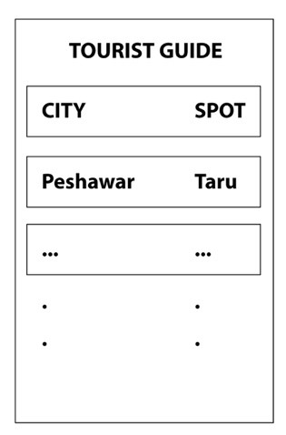
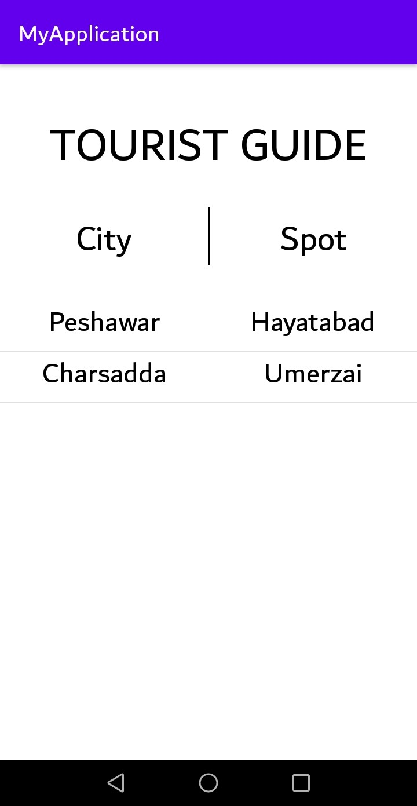
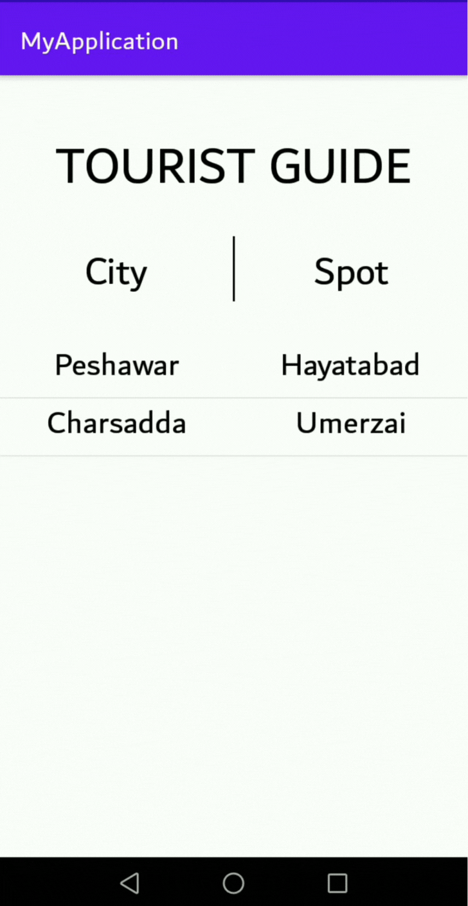

# Mobile Computing Assignment - 1

## Questions

### Question 1.(a)

```
Create an activity which stores 2 cities and 2 spots (one for each city) using shared Preferences. [Only Java Code]
•	Shared Preferences file name should be your yourname-yourprogram-yoursection.
•	First City should be your city and First Spot should be your home address/area. Rest of the cities & spots can be random.
•	Store any other information you need for Q1(c)
```

<br/>

### Question 1.(b)

```
Create another activity which display the saved record in Shared Preferences file using custom listview (dynamic content / dynamic layout). Layout Sample attached below. [ XML – Java Code]
```

<br/>

<div align="center">
    <a href="image.jpg">
        
    </a>
</div>

<br/>

### Question 1.(c)

```
On clicking each list item your activity should redirect to Google Maps and open that spot. [Java Code]
```

<br/>

### Question 1.(d)

```
On long click each  list item should be deleted from the listview. [Java Code]
```

<br/>

## Solution (in parts)

### Question 1. (a)

```
String[] details = {"Peshawar", "Hayatabad", "Charsadda", "Umerzai"};

SharedPreferences sp = getSharedPreferences("Samama-BSSE-A",MODE_PRIVATE);

SharedPreferences.Editor editor = sp.edit();

editor.putString("City1",details[0]);
editor.putString("Spot1",details[1]);

editor.putString("City2",details[2]);
editor.putString("Spot2",details[3]);

editor.commit();
```

<br/>

### Question 1. (b)

```
<!-- XML Code Part - Main Activity Layout -->
<?xml version="1.0" encoding="utf-8"?>
<LinearLayout xmlns:android="http://schemas.android.com/apk/res/android"
    xmlns:app="http://schemas.android.com/apk/res-auto"
    xmlns:tools="http://schemas.android.com/tools"
    android:layout_width="match_parent"
    android:layout_height="match_parent"
    tools:context=".MainActivity"
    android:orientation="vertical">

    <TextView
        android:layout_width="match_parent"
        android:layout_height="wrap_content"
        android:text="TOURIST GUIDE"
        android:gravity="center"
        android:textSize="40dp"
        android:textColor="@color/black"
        android:paddingTop="40dp"
        android:paddingBottom="10dp"/>

    <LinearLayout
        android:layout_width="match_parent"
        android:layout_height="wrap_content"
        android:orientation="horizontal"
        android:weightSum="2"
        android:paddingVertical="20dp">

        <TextView
            android:layout_width="match_parent"
            android:layout_height="match_parent"
            android:layout_weight="1"
            android:text="City"
            android:gravity="center"
            android:textSize="30dp"
            android:textColor="@color/black"/>

        <LinearLayout
            android:layout_width="wrap_content"
            android:layout_height="50dp"
            android:orientation="vertical">

            <View
                android:layout_width="3px"
                android:layout_height="match_parent"
                android:background="@color/black" />

        </LinearLayout>

        <TextView
            android:layout_width="match_parent"
            android:layout_height="match_parent"
            android:layout_weight="1"
            android:text="Spot"
            android:gravity="center"
            android:textSize="30dp"
            android:textColor="@color/black"/>

    </LinearLayout>

    <ListView
        android:layout_width="match_parent"
        android:layout_height="match_parent"
        android:id="@+id/listview"
        android:paddingTop="10dp"/>

</LinearLayout>
<!-- END -->

<!-- XML Code Part - Extended - Custom List Layout -->
<?xml version="1.0" encoding="utf-8"?>
<LinearLayout xmlns:android="http://schemas.android.com/apk/res/android"
    android:layout_width="match_parent"
    android:layout_height="wrap_content"
    android:orientation="horizontal"
    android:weightSum="2"
    android:id="@+id/llparent">

    <TextView
        android:layout_width="match_parent"
        android:layout_height="match_parent"
        android:layout_weight="1"
        android:text="City"
        android:gravity="center"
        android:id="@+id/city"
        android:textSize="25dp"
        android:textColor="@color/black"
        android:paddingBottom="10dp"/>

    <TextView
        android:layout_width="match_parent"
        android:layout_height="match_parent"
        android:layout_weight="1"
        android:text="Spot"
        android:gravity="center"
        android:id="@+id/spot"
        android:textSize="25dp"
        android:textColor="@color/black"
        android:paddingBottom="10dp"/>

</LinearLayout>
<!-- END -->

// Java Code Part

                            .
                            .
                            .

ListView lv = (ListView)findViewById(R.id.listview);
CustomAdapter ca = new CustomAdapter();
lv.setAdapter(ca);

                            .
                            .
                            .

class CustomAdapter extends BaseAdapter {

    SharedPreferences sp = getSharedPreferences("Samama-BSSE-A",MODE_PRIVATE);

    String city1 = sp.getString("City1", "city1");
    String spot1 = sp.getString("Spot1", "spot1");

    String city2 = sp.getString("City2", "city1");
    String spot2 = sp.getString("Spot2", "spot1");

    ArrayList<String> cities = new ArrayList<String>();
    ArrayList<String> spots = new ArrayList<String>();

    {
        cities.add(city1);
        cities.add(city2);

        spots.add(spot1);
        spots.add(spot2);
    }

    @Override
    public int getCount() {
        return cities.size();
    }

    @Override
    public Object getItem(int position) {
        return null;
    }

    @Override
    public long getItemId(int position) {
        return position;
    }

    @Override
    public View getView(int position, View convertView, ViewGroup parent) {

        convertView = getLayoutInflater().inflate(R.layout.listlayout, null);
        TextView tv1 = (TextView)convertView.findViewById(R.id.city);
        TextView tv2 = (TextView)convertView.findViewById(R.id.spot);

        tv1.setText(cities.get(position));
        tv2.setText(spots.get(position));

        return convertView;
    }
}

                            .
                            .
                            .

// END
```

<br/>

### Question 1. (c)

```
lv.setOnItemClickListener(new AdapterView.OnItemClickListener() {

    @Override
    public void onItemClick(AdapterView<?> adapterView, View view, int i, long l) {

        TextView tv = (TextView)view.findViewById(R.id.spot);
        String spot = tv.getText().toString();

        Uri intentpath = Uri.parse("geo:0,0?q="+spot);
        Intent intent = new Intent(Intent.ACTION_VIEW, intentpath);
        intent.setPackage("com.google.android.apps.maps");

        if (intent.resolveActivity(getPackageManager()) != null) {
            startActivity(intent);
        }
    }
});
```

<br/>

### Question 1. (d)

```
lv.setOnItemLongClickListener(new AdapterView.OnItemLongClickListener() {
    @Override
    public boolean onItemLongClick(AdapterView<?> adapterView, View view, int i, long l) {
        ca.remove(i);
        return false;
    }
});

                            .
                            .
                            .

public void remove(int i) {
    cities.remove(i);
    spots.remove(i);
    notifyDataSetChanged();
}

                            .
                            .
                            .

```

<br/>

## Solution (complete application)

### [activity_main.xml :](./MyApplication/app/src/main/res/layout/activity_main.xml)

```
<!-- Question 1.(b) XML Code Part - Main Activity Layout -->
<?xml version="1.0" encoding="utf-8"?>
<LinearLayout xmlns:android="http://schemas.android.com/apk/res/android"
    xmlns:app="http://schemas.android.com/apk/res-auto"
    xmlns:tools="http://schemas.android.com/tools"
    android:layout_width="match_parent"
    android:layout_height="match_parent"
    tools:context=".MainActivity"
    android:orientation="vertical">

    <TextView
        android:layout_width="match_parent"
        android:layout_height="wrap_content"
        android:text="TOURIST GUIDE"
        android:gravity="center"
        android:textSize="40dp"
        android:textColor="@color/black"
        android:paddingTop="40dp"
        android:paddingBottom="10dp"/>

    <LinearLayout
        android:layout_width="match_parent"
        android:layout_height="wrap_content"
        android:orientation="horizontal"
        android:weightSum="2"
        android:paddingVertical="20dp">

        <TextView
            android:layout_width="match_parent"
            android:layout_height="match_parent"
            android:layout_weight="1"
            android:text="City"
            android:gravity="center"
            android:textSize="30dp"
            android:textColor="@color/black"/>

        <LinearLayout
            android:layout_width="wrap_content"
            android:layout_height="50dp"
            android:orientation="vertical">

            <View
                android:layout_width="3px"
                android:layout_height="match_parent"
                android:background="@color/black" />

        </LinearLayout>

        <TextView
            android:layout_width="match_parent"
            android:layout_height="match_parent"
            android:layout_weight="1"
            android:text="Spot"
            android:gravity="center"
            android:textSize="30dp"
            android:textColor="@color/black"/>

    </LinearLayout>

    <ListView
        android:layout_width="match_parent"
        android:layout_height="match_parent"
        android:id="@+id/listview"
        android:paddingTop="10dp"/>

</LinearLayout>
```

<br/>

### [listlayout.xml :](./MyApplication/app/src/main/res/layout/listlayout.xml)

```
<!-- Question 1.(b) XML Code Part - Extended - Custom List Layout -->
<?xml version="1.0" encoding="utf-8"?>
<LinearLayout xmlns:android="http://schemas.android.com/apk/res/android"
    android:layout_width="match_parent"
    android:layout_height="wrap_content"
    android:orientation="horizontal"
    android:weightSum="2"
    android:id="@+id/llparent">

    <TextView
        android:layout_width="match_parent"
        android:layout_height="match_parent"
        android:layout_weight="1"
        android:text="City"
        android:gravity="center"
        android:id="@+id/city"
        android:textSize="25dp"
        android:textColor="@color/black"
        android:paddingBottom="10dp"/>

    <TextView
        android:layout_width="match_parent"
        android:layout_height="match_parent"
        android:layout_weight="1"
        android:text="Spot"
        android:gravity="center"
        android:id="@+id/spot"
        android:textSize="25dp"
        android:textColor="@color/black"
        android:paddingBottom="10dp"/>

</LinearLayout>
```

<br/>

### [MainActivity.java :](./MyApplication/app/src/main/java/com/example/myapplication/MainActivity.java)

```
package com.example.myapplication;

import androidx.appcompat.app.AppCompatActivity;

import android.content.Intent;
import android.content.SharedPreferences;
import android.net.Uri;
import android.os.Bundle;
import android.view.View;
import android.view.ViewGroup;
import android.widget.AdapterView;
import android.widget.BaseAdapter;
import android.widget.ListView;
import android.widget.TextView;

import java.util.ArrayList;

public class MainActivity extends AppCompatActivity {
    @Override
    public void onCreate(Bundle savedInstanceState) {
        super.onCreate(savedInstanceState);
        setContentView(R.layout.activity_main);


        // Question 1.(a) Answer
        String[] details = {"Peshawar", "Hayatabad", "Charsadda", "Umerzai"};

        SharedPreferences sp = getSharedPreferences("Samama-BSSE-A",MODE_PRIVATE);

        SharedPreferences.Editor editor = sp.edit();

        editor.putString("City1",details[0]);
        editor.putString("Spot1",details[1]);

        editor.putString("City2",details[2]);
        editor.putString("Spot2",details[3]);

        editor.commit();
        // END

        // Question 1.(b) Answer Java Code Part
        ListView lv = (ListView)findViewById(R.id.listview);
        CustomAdapter ca = new CustomAdapter();
        lv.setAdapter(ca);
        // END

        // Question 1.(c) Answer
        lv.setOnItemClickListener(new AdapterView.OnItemClickListener() {
            @Override
            public void onItemClick(AdapterView<?> adapterView, View view, int i, long l) {
                TextView tv = (TextView)view.findViewById(R.id.spot);
                String spot = tv.getText().toString();

                Uri intentpath = Uri.parse("geo:0,0?q="+spot);
                Intent intent = new Intent(Intent.ACTION_VIEW, intentpath);
                intent.setPackage("com.google.android.apps.maps");

                if (intent.resolveActivity(getPackageManager()) != null) {
                    startActivity(intent);
                }
            }
        });
        // END

        // Question 1.(d) Answer
        lv.setOnItemLongClickListener(new AdapterView.OnItemLongClickListener() {
            @Override
            public boolean onItemLongClick(AdapterView<?> adapterView, View view, int i, long l) {
                ca.remove(i);
                return false;
            }
        });
        // END
    }

    // Question 1.(b) Answer Java Code Part - Extended
    class CustomAdapter extends BaseAdapter {

        SharedPreferences sp = getSharedPreferences("Samama-BSSE-A",MODE_PRIVATE);

        String city1 = sp.getString("City1", "city1");
        String spot1 = sp.getString("Spot1", "spot1");

        String city2 = sp.getString("City2", "city1");
        String spot2 = sp.getString("Spot2", "spot1");

        ArrayList<String> cities = new ArrayList<String>();
        ArrayList<String> spots = new ArrayList<String>();

        {
            cities.add(city1);
            cities.add(city2);

            spots.add(spot1);
            spots.add(spot2);
        }

        @Override
        public int getCount() {
            return cities.size();
        }

        @Override
        public Object getItem(int position) {
            return null;
        }

        @Override
        public long getItemId(int position) {
            return position;
        }

        @Override
        public View getView(int position, View convertView, ViewGroup parent) {
            convertView = getLayoutInflater().inflate(R.layout.listlayout, null);
            TextView tv1 = (TextView)convertView.findViewById(R.id.city);
            TextView tv2 = (TextView)convertView.findViewById(R.id.spot);

            tv1.setText(cities.get(position));
            tv2.setText(spots.get(position));

            return convertView;
        }

        // Question 1.(d) Answer - Extended -Excluded from Question 1.(b) Answer
        public void remove(int i) {
            cities.remove(i);
            spots.remove(i);
            notifyDataSetChanged();
        }
        // END
    }
    // END
}
```

<br/>

## Screenshot

<br/>

<div align="center">
    <a href="screenshot.jpg">
        
    </a>
</div>

<br/>
<br/>

## Demo

### Short Click

<br/>

<div align="center">
    <a href="shortclick.gif">
        
    </a>
</div>

<br/>
<br/>

### Long Click

<br/>

<div align="center">
    <a href="longclick.gif">
        
    </a>
</div>
