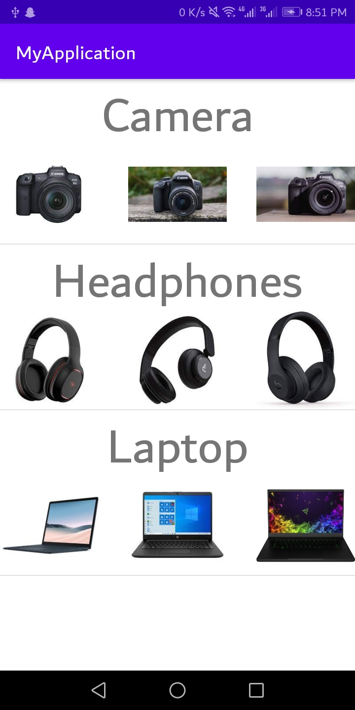

# Mobile Computing Lab Task - 1

## Question

```
Replace hello world with your name in activity_main.xml
```

<br/>

## Solution

### [activity_main.xml :](./MyApplication/app/src/main/res/layout/activity_main.xml)

```
<?xml version="1.0" encoding="utf-8"?>
<androidx.constraintlayout.widget.ConstraintLayout xmlns:android="http://schemas.android.com/apk/res/android"
    xmlns:app="http://schemas.android.com/apk/res-auto"
    xmlns:tools="http://schemas.android.com/tools"
    android:layout_width="match_parent"
    android:layout_height="match_parent"
    tools:context=".MainActivity">

    <TextView
        android:layout_width="wrap_content"
        android:layout_height="wrap_content"
        android:text="Samama"
        app:layout_constraintBottom_toBottomOf="parent"
        app:layout_constraintLeft_toLeftOf="parent"
        app:layout_constraintRight_toRightOf="parent"
        app:layout_constraintTop_toTopOf="parent" />

</androidx.constraintlayout.widget.ConstraintLayout>
```

<br/>

## Screenshot

<br/>

<div align="center">
    <a href="screenshot.png">
        
    </a>
</div>
