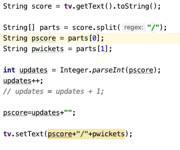
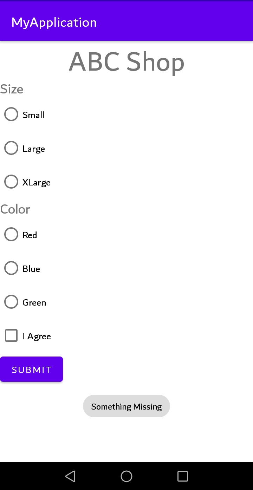

# Mobile Computing Lab Task - 5

## Question

```
Design a simple calculator which takes 2 values(EditText) from user and display their sum using Toast
```

<br/>

<div align="center">
    
</div>

<br/>

## Solution

### [activity_main.xml :](./MyApplication/app/src/main/res/layout/activity_main.xml)

```
<?xml version="1.0" encoding="utf-8"?>
<LinearLayout xmlns:android="http://schemas.android.com/apk/res/android"
    xmlns:app="http://schemas.android.com/apk/res-auto"
    xmlns:tools="http://schemas.android.com/tools"
    android:layout_width="match_parent"
    android:layout_height="match_parent"
    tools:context=".MainActivity"
    android:orientation="vertical">

    <EditText
        android:layout_width="match_parent"
        android:layout_height="wrap_content"
        android:hint="Number 1"
        android:id="@+id/num1"/>

    <EditText
        android:layout_width="match_parent"
        android:layout_height="wrap_content"
        android:hint="Number 2"
        android:id="@+id/num2"/>

    <Button
        android:layout_width="match_parent"
        android:layout_height="wrap_content"
        android:text="test"
        android:onClick="BtnMethod"/>

</LinearLayout>
```

<br/>

[MainActivity.java :](./MyApplication/app/src/main/java/com/example/myapplication/MainActivity.java)

```
package com.example.myapplication;

import androidx.appcompat.app.AppCompatActivity;

import android.os.Bundle;
import android.view.View;
import android.widget.EditText;
import android.widget.Toast;

public class MainActivity extends AppCompatActivity {

    @Override
    protected void onCreate(Bundle savedInstanceState) {
        super.onCreate(savedInstanceState);
        setContentView(R.layout.activity_main);
    }

    public void BtnMethod(View view) {

        EditText text1 = (EditText)findViewById(R.id.num1);
        EditText text2 = (EditText)findViewById(R.id.num2);

        int num1 = Integer.parseInt(text1.getText().toString());
        int num2 = Integer.parseInt(text2.getText().toString());

        String result = Integer.toString(num1+num2);

        Toast.makeText(this, result, Toast.LENGTH_LONG).show();

    }
}
```

<br/>

## Screenshots

<br/>

<div align="center">
    <a href="screenshot.png">
        
    </a>
</div>

<br/>
<br/>

<div align="center">
    <a href="screenshot1.png">
        
    </a>
</div>
