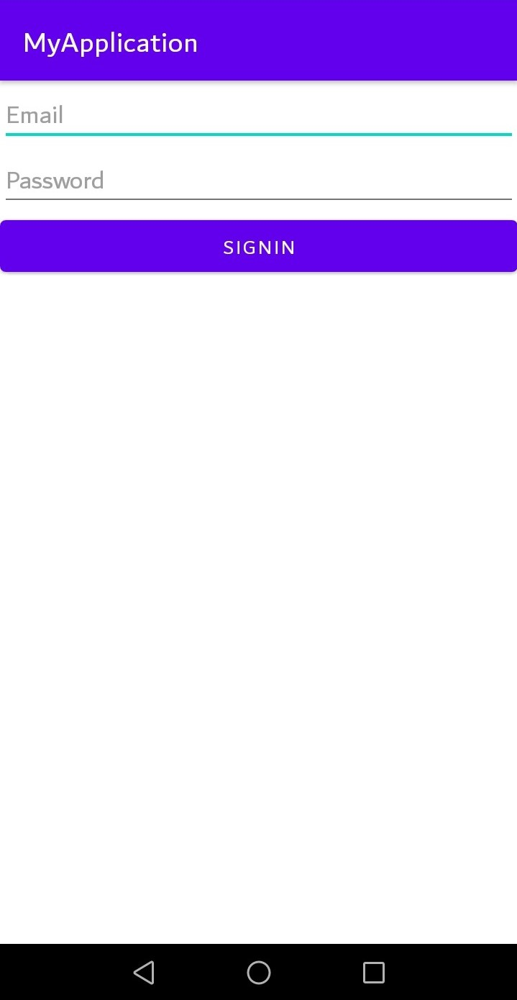

# Mobile Computing Lab Task - 10

## Question

```
Part 1:
    Create a Signup Screen containing
        1. Name
        2. Email
        3. Password
    Store these three values in Shared Preferences.

Part 2:
    Create a new activity Named Login. Use to saved Email and password to login. If credentials match display a toast Message.
```

## Solution

### Part 1

### [activity_main.xml :](./MyApplication/app/src/main/res/layout/activity_main.xml)

```
<?xml version="1.0" encoding="utf-8"?>
<LinearLayout xmlns:android="http://schemas.android.com/apk/res/android"
    xmlns:app="http://schemas.android.com/apk/res-auto"
    xmlns:tools="http://schemas.android.com/tools"
    android:layout_width="match_parent"
    android:layout_height="match_parent"
    tools:context=".MainActivity"
    android:orientation="vertical">

    <EditText
        android:layout_width="match_parent"
        android:layout_height="wrap_content"
        android:hint="Name"
        android:id="@+id/name"/>

    <EditText
        android:layout_width="match_parent"
        android:layout_height="wrap_content"
        android:hint="Email"
        android:id="@+id/email"/>

    <EditText
        android:layout_width="match_parent"
        android:layout_height="wrap_content"
        android:hint="Password"
        android:id="@+id/pass"/>

    <Button
        android:layout_width="match_parent"
        android:layout_height="wrap_content"
        android:text="Signup"
        android:id="@+id/subtn"
        android:onClick="signup"/>

    <Button
        android:layout_width="match_parent"
        android:layout_height="wrap_content"
        android:text="To Signin Screen"
        android:id="@+id/sibtn"
        android:onClick="tosignin"/>

</LinearLayout>
```

<br/>

### [MainActivity.java :](./MyApplication/app/src/main/java/com/example/myapplication/MainActivity.java)

```
package com.example.myapplication;

import androidx.appcompat.app.AppCompatActivity;

import android.content.Intent;
import android.content.SharedPreferences;
import android.os.Bundle;
import android.view.View;
import android.widget.EditText;
import android.widget.Toast;

public class MainActivity extends AppCompatActivity {
    @Override
    protected void onCreate(Bundle savedInstanceState) {
        super.onCreate(savedInstanceState);
        setContentView(R.layout.activity_main);
    }

    public void signup(View view) {
        EditText name = (EditText)findViewById(R.id.name);
        EditText email = (EditText)findViewById(R.id.email);
        EditText pass = (EditText)findViewById(R.id.pass);

        String Value = name.getText().toString();
        String Value2 = email.getText().toString();
        String Value3 = pass.getText().toString();

        SharedPreferences sp = getSharedPreferences("Details",MODE_PRIVATE);

        SharedPreferences.Editor editor = sp.edit();

        editor.putString("Name",Value);
        editor.putString("Email",Value2);
        editor.putString("Password",Value3);

        boolean check=false;
        check = editor.commit();

        if(check) {
            Toast.makeText(this, "Signup Successful", Toast.LENGTH_SHORT).show();
        }
    }

    public void tosignin(View view) {
        Intent intent = new Intent(this, MainActivity2.class);
        startActivity(intent);

    }
}
```

<br/>

### Part 2

### [activity_main2.xml :](./MyApplication/app/src/main/res/layout/activity_main2.xml)

```
<?xml version="1.0" encoding="utf-8"?>
<LinearLayout xmlns:android="http://schemas.android.com/apk/res/android"
    xmlns:app="http://schemas.android.com/apk/res-auto"
    xmlns:tools="http://schemas.android.com/tools"
    android:layout_width="match_parent"
    android:layout_height="match_parent"
    tools:context=".MainActivity2"
    android:orientation="vertical">

    <EditText
        android:layout_width="match_parent"
        android:layout_height="wrap_content"
        android:hint="Email"
        android:id="@+id/email"/>

    <EditText
        android:layout_width="match_parent"
        android:layout_height="wrap_content"
        android:hint="Password"
        android:id="@+id/pass"/>

    <Button
        android:layout_width="match_parent"
        android:layout_height="wrap_content"
        android:text="Signin"
        android:id="@+id/subtn"
        android:onClick="signin"/>

</LinearLayout>
```

<br/>

### [MainActivity2.java :](./MyApplication/app/src/main/java/com/example/myapplication/MainActivity2.java)

```
package com.example.myapplication;

import androidx.appcompat.app.AppCompatActivity;

import android.content.SharedPreferences;
import android.os.Bundle;
import android.view.View;
import android.widget.EditText;
import android.widget.Toast;

public class MainActivity2 extends AppCompatActivity {
    @Override
    protected void onCreate(Bundle savedInstanceState) {
        super.onCreate(savedInstanceState);
        setContentView(R.layout.activity_main2);
    }

    public void signin(View view) {
        EditText email = (EditText)findViewById(R.id.email);
        EditText pass = (EditText)findViewById(R.id.pass);

        String Email = email.getText().toString();
        String Password = pass.getText().toString();

        SharedPreferences sp = getSharedPreferences("Details",MODE_PRIVATE);

        String EMAIL = sp.getString("Email", "someone@something.com");
        String PASSWORD = sp.getString("Password", "########");

        if (EMAIL.equals(Email) && PASSWORD.equals(Password)) {
            Toast.makeText(this, "Signin Successful", Toast.LENGTH_SHORT).show();
        } else {
            Toast.makeText(this, "Signin Failed", Toast.LENGTH_SHORT).show();
        }
    }
}
```

<br/>

## Shared Preference File

### [Details.xml](Details.xml)

```
<?xml version='1.0' encoding='utf-8' standalone='yes' ?>
<map>
    <string name="Email">example@email.com</string>
    <string name="Name">Samama</string>
    <string name="Password">password</string>
</map>
```

<br/>

## Screenshots

<br/>

## Part 1:

<br/>

<a href="screenshot.png">
    
</a>

<br/>
<br/>

<a href="screenshot1.png">
    
</a>

<br/>
<br/>

## Part 2

<br/>

<a href="screenshot2.png">
    
</a>

<br/>
<br/>

<a href="screenshot3.png">
    
</a>
