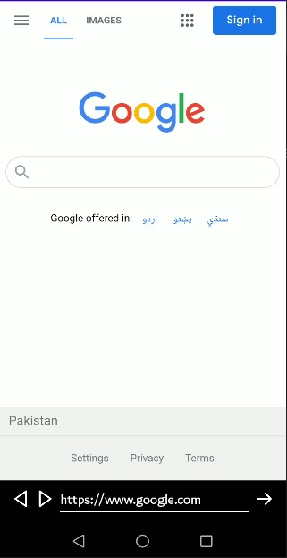

# Mobile Computing Lab Task - 4

## Question

```
Implement the following Layout using Custom List View
```

<br/>

<div align="center">
    <a href="customlistassignment.jpg">
        
    </a>
</div>

<br/>

## Solution

### [activity_main.xml :](./MyApplication/app/src/main/res/layout/activity_main.xml)

```
<?xml version="1.0" encoding="utf-8"?>
<LinearLayout xmlns:android="http://schemas.android.com/apk/res/android"
    xmlns:app="http://schemas.android.com/apk/res-auto"
    xmlns:tools="http://schemas.android.com/tools"
    android:layout_width="match_parent"
    android:layout_height="match_parent"
    tools:context=".MainActivity"
    android:orientation="vertical">

    <ListView
        android:layout_width="match_parent"
        android:layout_height="match_parent"
        android:id="@+id/listview"/>

</LinearLayout>

```

<br/>

### [customlistlayout.xml :](./MyApplication/app/src/main/res/layout/customlistlayout.xml)

```
<?xml version="1.0" encoding="utf-8"?>
<RelativeLayout xmlns:android="http://schemas.android.com/apk/res/android"
    android:layout_width="match_parent"
    android:layout_height="match_parent"
    android:orientation="vertical" >

    <TextView
        android:id="@+id/textview"
        android:layout_width="match_parent"
        android:layout_height="wrap_content"
        android:text="test"
        android:textSize="50dp"
        android:gravity="center"
        android:layout_alignParentTop="true"
        android:layout_centerHorizontal="true" />

    <ImageView
        android:id="@+id/img1"
        android:layout_width="100dp"
        android:layout_height="100dp"
        android:layout_alignParentLeft="true"
        android:layout_below="@+id/textview" />

    <ImageView
        android:id="@+id/img2"
        android:layout_width="100dp"
        android:layout_height="100dp"
        android:layout_centerHorizontal="true"
        android:layout_below="@+id/textview" />

    <ImageView
        android:id="@+id/img3"
        android:layout_width="100dp"
        android:layout_height="100dp"
        android:layout_alignParentRight="true"
        android:layout_below="@+id/textview" />

</RelativeLayout>
```

<br/>

### [MainActivity.java :](./MyApplication/app/src/main/java/com/example/myapplication/MainActivity.java)

```
package com.example.myapplication;

import androidx.appcompat.app.AppCompatActivity;

import android.os.Bundle;
import android.view.View;
import android.view.ViewGroup;
import android.widget.BaseAdapter;
import android.widget.ImageView;
import android.widget.ListView;
import android.widget.TextView;

public class MainActivity extends AppCompatActivity {

    String listitems[] = {"Camera", "Headphones", "Laptop"};
    int Images1[] = {R.drawable.camera1, R.drawable.headphones1, R.drawable.laptop1};
    int Images2[] = {R.drawable.camera2, R.drawable.headphones2, R.drawable.laptop2};
    int Images3[] = {R.drawable.camera3, R.drawable.headphones3, R.drawable.laptop3};

    @Override
    protected void onCreate(Bundle savedInstanceState) {
        super.onCreate(savedInstanceState);
        setContentView(R.layout.activity_main);

        ListView lv = (ListView)findViewById(R.id.listview);
        CustomAdapter ca = new CustomAdapter();
        lv.setAdapter(ca);
    }

    class CustomAdapter extends BaseAdapter {

        @Override
        public int getCount() {
            return listitems.length;
        }

        @Override
        public Object getItem(int position) {
            return null;
        }

        @Override
        public long getItemId(int position) {
            return 0;
        }

        @Override
        public View getView(int position, View convertView, ViewGroup parent) {
            convertView = getLayoutInflater().inflate(R.layout.customlistlayout, null);
            TextView tv = (TextView)convertView.findViewById(R.id.textview);
            ImageView imgv1 = (ImageView)convertView.findViewById(R.id.img1);
            ImageView imgv2 = (ImageView)convertView.findViewById(R.id.img2);
            ImageView imgv3 = (ImageView)convertView.findViewById(R.id.img3);

            tv.setText(listitems[position]);
            imgv1.setImageResource(Images1[position]);
            imgv2.setImageResource(Images2[position]);
            imgv3.setImageResource(Images3[position]);

            return convertView;
        }

    }

}
```

<br/>

## Screenshot

<br/>

<div align="center">
    <a href="screenshot.png">
        
    </a>
</div>
