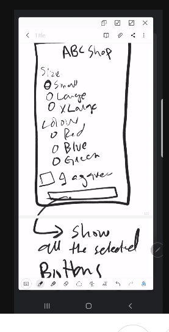

# Mobile Computing Lab Task - 5

## Question

```
Design the layout using Relative Layout/Linear Layout/ Nested Layout.
```

<div align="center">
    
</div>

<br/>

## Solution

### [activity_main.xml :](./MyApplication/app/src/main/res/layout/activity_main.xml)

```
<?xml version="1.0" encoding="utf-8"?>
<LinearLayout xmlns:android="http://schemas.android.com/apk/res/android"
    xmlns:app="http://schemas.android.com/apk/res-auto"
    xmlns:tools="http://schemas.android.com/tools"
    android:layout_width="match_parent"
    android:layout_height="match_parent"
    tools:context=".MainActivity"
    android:orientation="vertical" >

    <LinearLayout
        android:layout_width="match_parent"
        android:layout_height="wrap_content"
        android:gravity="center"
        android:layout_marginTop="20dp"
        android:layout_marginBottom="50dp" >

        <ImageView
            android:layout_width="wrap_content"
            android:layout_height="150dp"
            android:src="@drawable/psl" />

    </LinearLayout>

    <LinearLayout
        android:layout_width="match_parent"
        android:layout_height="wrap_content"
        android:gravity="center"
        android:layout_weight="3"
        android:layout_marginBottom="100dp" >

        <LinearLayout
            android:layout_width="match_parent"
            android:layout_height="match_parent"
            android:orientation="vertical"
            android:gravity="center|top"
            android:layout_weight="1" >

            <TextView
                android:layout_width="wrap_content"
                android:layout_height="wrap_content"
                android:text="Peshawar Zalmi"
                android:textSize="20dp"
                android:textColor="#303030 "
                android:layout_marginTop="10dp" />

            <TextView
                android:layout_width="wrap_content"
                android:layout_height="wrap_content"
                android:text="120/10"
                android:textSize="55dp"
                android:gravity="center"
                android:textColor="@color/black"
                android:layout_marginVertical="20dp" />

            <Button
                android:layout_width="match_parent"
                android:layout_height="wrap_content"
                android:backgroundTint="#d3d3d3"
                android:textColor="@color/black"
                android:text="update score"
                android:layout_marginVertical="5dp"
                android:layout_marginHorizontal="20dp" />

            <Button
                android:layout_width="match_parent"
                android:layout_height="wrap_content"
                android:backgroundTint="#d3d3d3"
                android:textColor="@color/black"
                android:text="update wickets"
                android:layout_marginVertical="5dp"
                android:layout_marginHorizontal="20dp" />

            <Button
                android:layout_width="match_parent"
                android:layout_height="wrap_content"
                android:backgroundTint="#d3d3d3"
                android:textColor="@color/black"
                android:text="reset"
                android:layout_marginVertical="5dp"
                android:layout_marginHorizontal="20dp" />

        </LinearLayout>

        <LinearLayout
            android:layout_width="wrap_content"
            android:layout_height="wrap_content"
            android:orientation="vertical">

            <View
                android:layout_width="3px"
                android:layout_height="match_parent"
                android:background="@color/black" />

        </LinearLayout>

        <LinearLayout
            android:layout_width="match_parent"
            android:layout_height="match_parent"
            android:orientation="vertical"
            android:gravity="center|top"
            android:layout_weight="1" >

            <TextView
                android:layout_width="wrap_content"
                android:layout_height="wrap_content"
                android:text="Karachi Kings"
                android:textColor="@color/black"
                android:textSize="20dp"
                android:layout_marginTop="10dp" />

            <TextView
                android:layout_width="wrap_content"
                android:layout_height="wrap_content"
                android:text="159/3"
                android:textSize="55dp"
                android:gravity="center"
                android:textColor="@color/black"
                android:layout_marginVertical="20dp" />

            <Button
                android:layout_width="match_parent"
                android:layout_height="wrap_content"
                android:text="update score"
                android:backgroundTint="#d3d3d3"
                android:textColor="@color/black"
                android:layout_marginVertical="5dp"
                android:layout_marginHorizontal="20dp" />

            <Button
                android:layout_width="match_parent"
                android:layout_height="wrap_content"
                android:text="update wickets"
                android:backgroundTint="#d3d3d3"
                android:textColor="@color/black"
                android:layout_marginVertical="5dp"
                android:layout_marginHorizontal="20dp" />

            <Button
                android:layout_width="match_parent"
                android:layout_height="wrap_content"
                android:text="reset"
                android:backgroundTint="#d3d3d3"
                android:textColor="@color/black"
                android:layout_marginVertical="5dp"
                android:layout_marginHorizontal="20dp" />

        </LinearLayout>

    </LinearLayout>

    <LinearLayout
        android:layout_width="match_parent"
        android:layout_height="wrap_content"
        android:gravity="center|bottom" >

        <Button
            android:layout_width="wrap_content"
            android:layout_height="wrap_content"
            android:backgroundTint="#d3d3d3"
            android:textColor="@color/black"
            android:text="new match" />

    </LinearLayout>

</LinearLayout>
```

<br/>

## Screenshot

<br/>

<div align="center">
    <a href="screenshot.png">
        
    </a>
</div>
